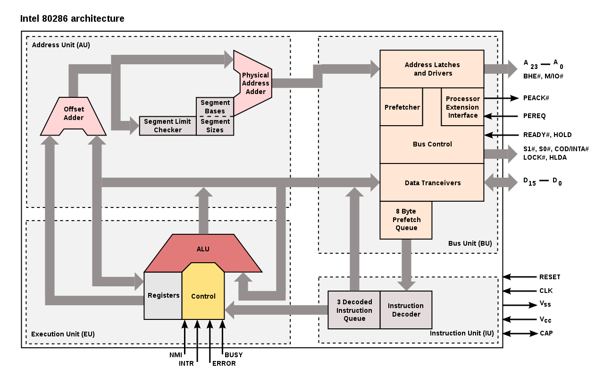
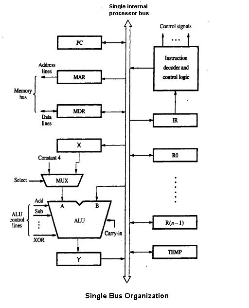

- x86-64 (aka x64, x86_64, AMD64 and Intel 64) is the 64-bit version of the x86 instruction set. popular among computers.
- x86 is a family of backward-compatible instruction set architectures based on the Intel 8086 CPU and its Intel 8088 variant.
- Instruction set architecture (ISA)(programming model) is an abstract model of a computer.(machine language)
  - instruction set consists of addressing modes, instructions, native data types, registers, memory architecture, interrupt, and exception handling, and external I/O.
  - Micro architecture is a way ISA, is implemented in a particular processor.
  
  
  
  - https://en.wikipedia.org/wiki/Microarchitecture
  - https://en.wikipedia.org/wiki/Instruction_set_architecture
  - https://en.wikipedia.org/wiki/Central_processing_unit
- Advanced RISC Machine (ARM) architecture is popular among smartphones.
  - https://en.wikipedia.org/wiki/ARM_architecture

## Architecture
- 8086
  -  16-bit extension of Intel's 8-bit-based 8080 microprocessor
  -  memory segmentation as a solution for addressing more memory
- 8080
- https://en.wikipedia.org/wiki/X86-64
- https://en.wikipedia.org/wiki/X86
- https://stackoverflow.com/questions/29467510/how-does-multi-level-page-table-save-memory-space

## Boot sequence
1. Booting Process
2. Booting Process, cont
3. Booting a Computer
4. BIOS
5. POST
6. Plug and play BIOS
7. Bootstrap Illustrated
8. First sector of a harddrive
9. Booting from active partition
10. Volume Boot Record
11. Booting the OS from the MBR
12. Boot Code
13. Sectors beyond MBR
14. Booting Windows XP and Server 2003
15. Booting Windows Vista/7
16. Operating System Components

### Brief
 - CPU initializes with system clock tick then CPU look to the system's ROM BIOS
  - BIOS stores instruction to run the power-on self test (POST), in a predetermined memory address.
    - POST checks:
      - BIOS chip 
      - CMOS RAM
      - Hardware devices
    - BIOS typically looks to the CMOS chip to tell it where to find the OS
    - CMOS looks to in order to locate the OS (Boot Sequence)
    - BIOS will get Boot record(where to find OS)
    - OS initializes, the BIOS copies its files into memory
    - OS basically takes over control of the boot process
- http://www.c-jump.com/CIS24/Slides/Booting/Booting.html#B01_0140_booting_windows_xp_an
